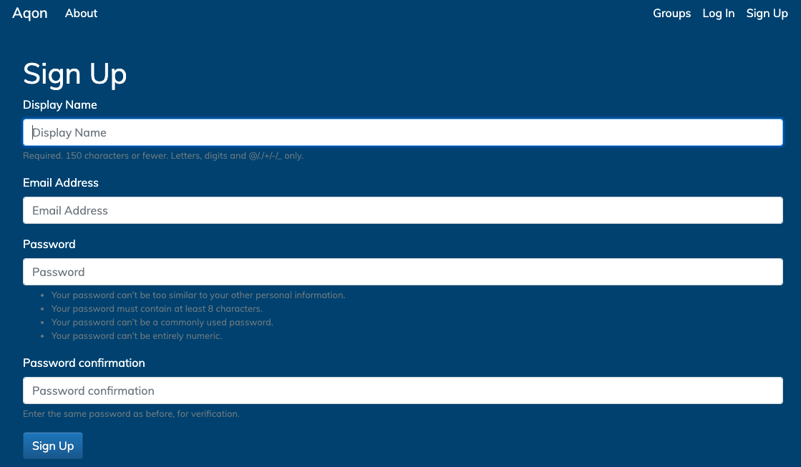
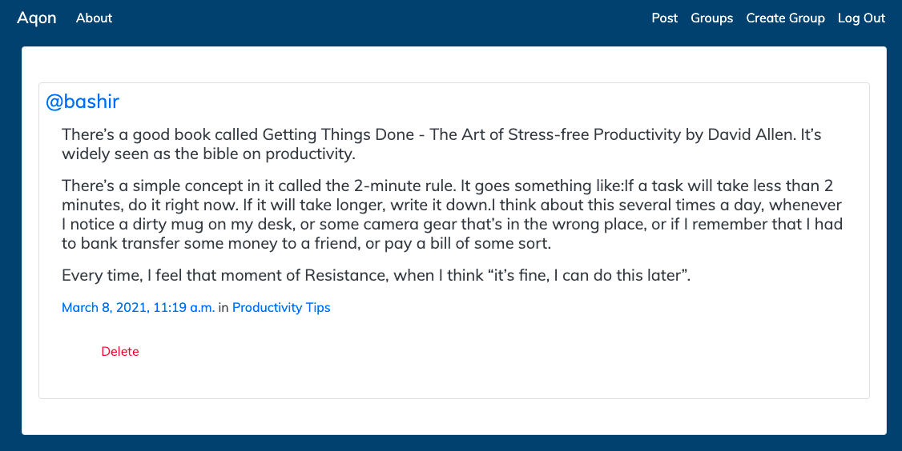

<br />
<p align="center">
  <h3 align="center">aqon</h3>
  <p align="center">
    Aqon is based on the theory of a community  <br> space where ideas can be shared and like minded people can connect.
  </p>
</p>
<br>
</h2> 

<p align="center" 

:rocket: **A Video Demo is available** <ins>  [**here**](https://drive.google.com/file/d/1vpRDKOz8qYeUkqt8s4B8M5ckILD7W95_/view?usp=sharing) </ins>
<br>
<br>
## Table of Contents

* [About the Project](#about-the-project)
* [Project Aim](#Project-Aim)
* [Built With](#built-with)
* [Getting Started](#getting-started)
* [Features](#features)
* [Django and Python](#django-and-python)
* [Design](#design)  
  * [Wireframe and Design](#wireframe)
  * [User Goals and needs](#goals)
  * [Typography & Hierarchy](#typography)
* [Entity Relationship Diagram](#ERD)
* [Screenshots](#screenshots)
* [Future Development](#future-development)

<br>
<br>

## About The Project
Aqon is a digital space where ideas can be shared and like minded people can connect. Users can create various forums to discuss topics ranging from tech news, healthy living, financial advice and many more. If there is not a group that matches your interest you have the opportunity to create your own space to grow. This website has many functions mentioned in the features section such as creating posts and socialising with other users.
<br>


## Project Aim 
To design and develop  Aqon the focuses was on a clean and minimal feel that is user friendly, enjoyable and informative. 

This website will appeal to multiple users from other platforms due to the familiarity to current applications on the market. 

The winning feature of this website is the unmatched user experience paired with ample amounts of knowledge sharing without the noise and saturation. 

## Built With


* [Django 3.1.5](https://docs.djangoproject.com/en/3.1/releases/3.1.5/)
* [Python 3.8.5](https://www.python.org/downloads/release/python-385/)
* [Bootstrap 5](https://getbootstrap.com/docs/5.0/getting-started/introduction/)
* [Font Awesome](https://fontawesome.com/)
* [Google Fonts](https://fonts.google.com/)
* [Figma](https://www.figma.com/?target=_blank) 
* [Lucid chart](https://www.lucidchart.com/?target=_blank)
* Custom CSS


<br>
<br>

## Getting Started

To get this Aqon up and running follow these simple steps.

1. Go to the project root folder 
2. Create virtual environment:
    ```python -m venv /path/to/new/virtual/environment```
3. Activate virtual environment 
4. Ensure you have installed the following packages
    ```
    pip install misaka
    pip install django-braces
    ```
4. start local server
`python manage.py runserver`


5. Got to the url shown on your terminal:
`http://127.0.0.1:8000/`


<br>
<br>

### Features

* Login/Logout 
* Groups _(similar to subreddits)_
* Sign-up with unique username  
* Multiple Users and Authorizations 
* Posts in groups _(similar to tweets)_
* Linking user profiles _(e.g. @sammy)_
* List groups
* Remove posts published
* Create new group 
* Join and leave groups 
* Group Members counts 
* Posts counts 
* Post History of user  
* Post History of group
* Minimal and Clean look with focus on content
* Responsive to all devices  
<br>

## Django and Python

* Public Third Party libraries 
* User Authentication 
* Session Controls
* Multiple Applications with each unique templates
* Class Based Views 
* Humanize in Django useful for adding a “human touch” to data.


### Design
## Wireframe


* Home Page: 


* Login :


* Mobile Responsive:


* New Post:


* All posts:


* Site Map:


* Design Thinking:


* Color Palette and Fonts:


### Goals


__Jobs to be done__

> a job-to-be-done is the manifestation of an unmute need or want in response to a trigger

In our case the user want to appreciate good writing and a safe place to share ideas with minimum distractions with clean design. 

The framework used to make sure we achieve users expectations is as follows: 

> [when ______][I want to ______] [so i can ______]
* Key focuse areas: 
    * when = _on the situation_
    * I want to = _on the motivation_
    * So I can = _on the outcome_

For our project when a user enters our website they can expect a clean and modern webpage with ease of conscious content consumption. 

A user research group has reported enjoying this website as a safe space to expect focus on educating, informing and building connections. The repeated user experience was positive. 


### Typography

##### Typography & Hierarchy

* Hierarchy is used to guide the user on most important features with no pointers or explanations required
* To establish hierarchy the use of different weights and fonts such as bold or light font sizes to indicate significance
* Buttons are imperative to indicate a change of state employing the use of color __Red__ for deleting a post
* Contrast between background color and text color is necessary for ease of reading and user cognition as proven by research in neurology studies globally
* Whitespace and Alignment gives the user space to consume content clearly without distraction.

### ERD

## Entity Relationship Diagram

The main aim to use the ERD was to visualise how elements are related to each other. 
The main entities are Post, Group and Post with each containing attributes that are unique such Primary key and Foreign keys. 

The relationship between User and Post is _one to many_ and one to many between relation between Group and Post as well as User and Post. A typical user will have many posts and can join as many groups as they wish however, each Post will have a unique User. 


## Screenshots

Home page:


About page:


Sign-up page:



Login page:


All posts/Feed:


New post form:


Review new post:



Create a new group:


Responsive view:


<br>
<br>

## Focus Group

An early prototype demo of this website was showcased to a small focus group of 8 individuals within the target group and are likely users of similar applications. The group was split into a blind trial group who navigated the website without any instructions. The second group received a briefing prior to using the application. Difference in speed times to understand layout and features was minimal between the two focus groups with an average time inference of 15 seconds. 

Limitations of this group may include that the majority were young and "tech savvy" and this may not represent a wider population. Feedback forms were submitted with suggestions for improvements which were taken on board for further updates of this website. 

## Future Development
The website has scope to improve and expand to fully functioning Aqon; the potential is endless. 

Development points suggested following user focus group include:

* Social sign-up such as gmail/Facebook
* Add more testing to make it even more robust, including integration testing
* Share feature for reposting into other platforms
* Create linked groups under bubbles for ease of navigation throughout the site
* Add options to incorporate different media types such as photos, mp4, GIFs

## Author

Done by Bashir


